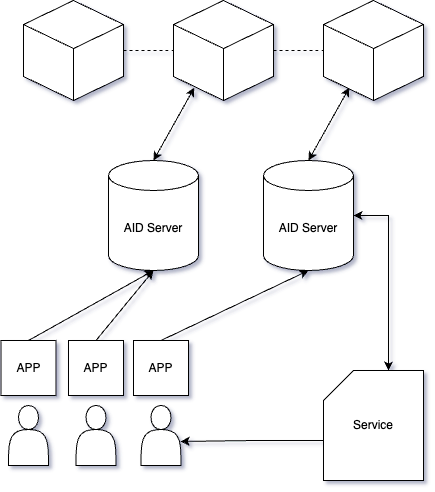
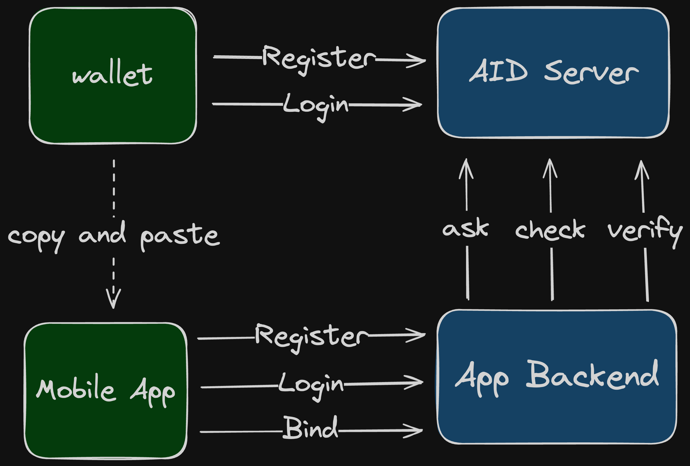
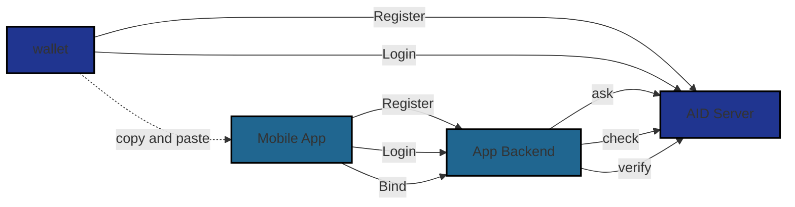

# aid
final aid project, include frontend SDK, backend, backend SDK

## 專案結構

```mermaid
graph LR
    A[wallet] -->|Register| B[AID Server]
    A -->|Login| B
    A -.->|copy and paste| C[Mobile App]
    C -->|Register| D[App Backend]
    C -->|Login| D
    D -->|ask| B
    D -->|check| B
    D -->|verify| B
    C -->|Bind| D
    
    style A fill:#203590,stroke:#000000,stroke-width:2px
    style B fill:#203590,stroke:#000000,stroke-width:2px
    style C fill:#206690,stroke:#000000,stroke-width:2px
    style D fill:#206690,stroke:#000000,stroke-width:2px
```
