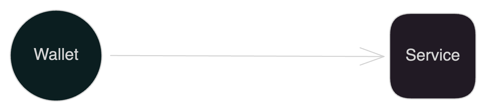
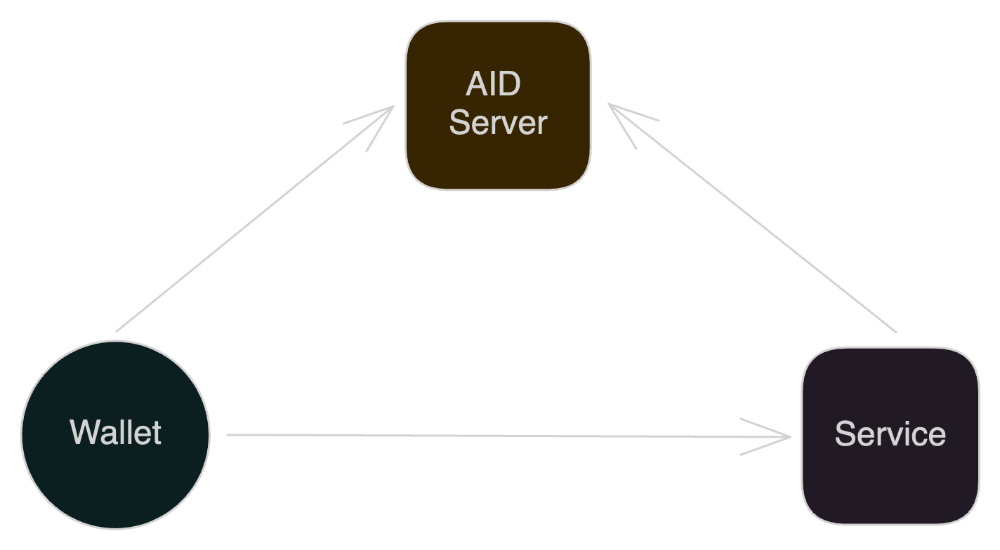
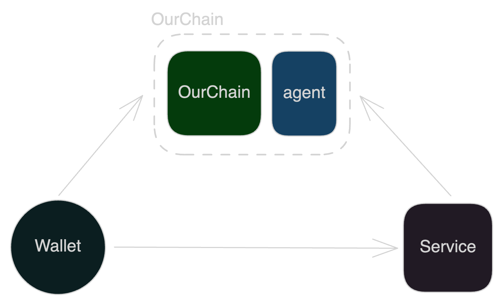
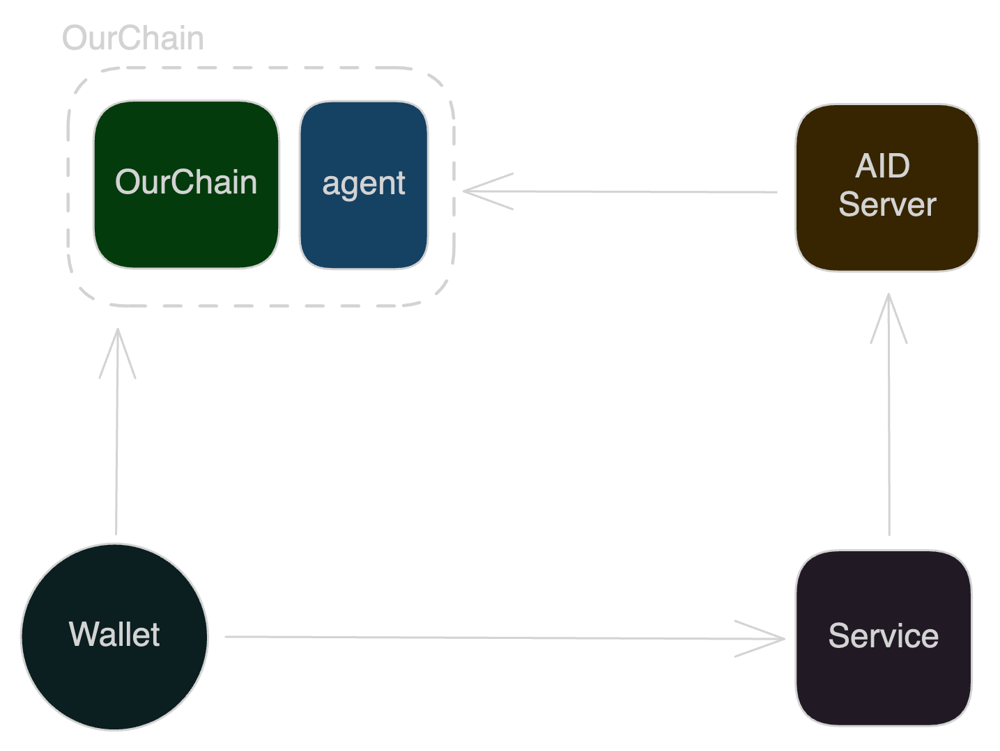

# aid

this project include [aid server implementation](./aid-server) and [full stack demo](./demo).

## Concept

provide rest api for service and wallet to verify user's claim.

## paper

- [Design and Implementation of Autonomous Identity System Based on OurChain](https://github.com/leon123858/aid-paper)

## aid system

four type of aid system:

### type1

- do not include blockchain and any other server, a P2P system.
- wallet create a id locally, and proof by itself.

### type2

- include a server, which can store user id and let service verify user's claim.

### type3

- like type2, but use OurChain to replace server.

### type4

- base on type3, but each user can ask a server to verify user's claim.
- also can know as a mixture of type2 and type3.

related project:

- [aid-server](https://github.com/leon123858/aid)
- [aid-wallet](https://github.com/leon123858/aidjs)
- [aid-service](https://github.com/leon123858/aidgo)
- [OurChain](https://github.com/leon123858/OurChain)
- [OurChain-Agent](https://github.com/leon123858/ourchain-agent)

## TODO

fork this project [link](https://github.com/goauthentik/authentik) and add a protocol named `aid` to it.
