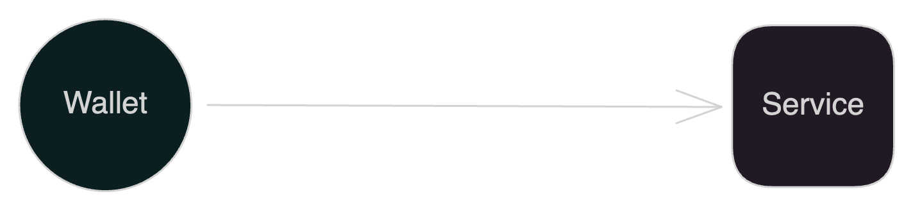

# DEMO of Type1

this is a demo of type1 AID

## Concept

a todo list can use aid to log in a remote todo list application, which can share the todo list with others.

## How to execute

1. start the backend (use `make`)
2. start the frontend (use `yarn start`)

## Usage

### Generate AID

1. Click the 'Generate AID' button to generate an AID.
2. which will be generated locally and stored in the local storage.

### edit local todo list

1. You can create a todo item, and also edit or delete it in this application.
2. After generating aid, you can use 'download' button to save todo list in aid to local storage.
3. You can also use 'upload' button to upload the todo list in aid from local storage.
4. each local storage bind with an aid, so you can use different aid to store different todo list.
5. this demo app always use the first aid generated in machine, you can use dev tool in browser to clear the local storage.

### share todo list and view others todo list

1. you can use 'login' and 'logout' button to connect to the server.
2. after login, you can use 'share' button to share local todo list to server.
3. others can use the aid to view the shared todo list by 'view' button.
4. after logout, the aid will be invalid, remote todo list will not be accessible.
