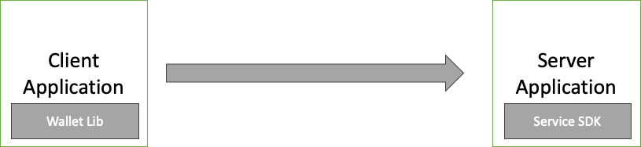
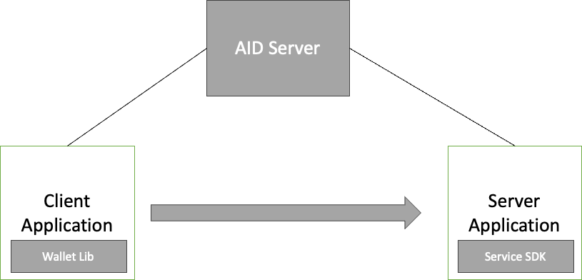
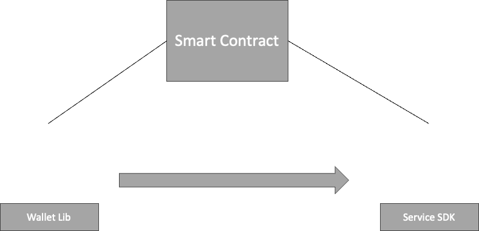
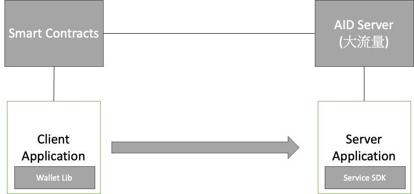
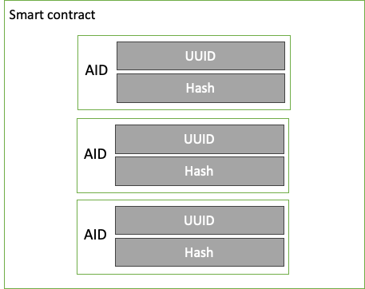
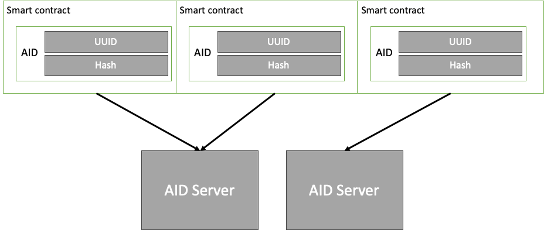
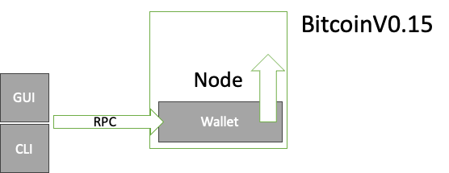
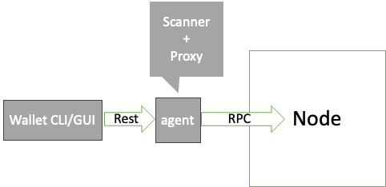

# 交接文件整理

## 1. 概述

這份文件總結了過去兩年的工作成果,主要分為三個領域:

1. AID (自主身份)相關
2. OurChain (區塊鏈)相關
3. 其他相關嘗試

ppt 中給出所有相關原始碼網址，大多數由我個人管理，若是後續有人要撰寫，可以完整複製(repository)後自行修改，無licence限制。

## 2. AID (自主身份)相關實作

### 2.1 AID 系統概述

AID 系統是由自己自主掌握的身份。根據論文理論,對簡單的情況下只需要一個用戶和一個服務雙方即可，用戶自主的登入服務，服務端不需要存儲用戶的任何信息，只需要驗證用戶的身份即可。

因此，我的實作聚焦在兩個方面

- 提供方便用戶實作AID系統的外部套件，分別是用戶端和服務端的套件
- 利用套件實作基於AID的應用程式作為demo，方便其他人了解套件的使用方法

### 2.2 外部套件

- 提供了 Wallet library 給移動應用，用戶端可以引用這個，讓自己可以更輕易的串接符合AID系統說明的後端服務。
- 提供了 Service SDK (也可視為 library) 給服務端，服務端可以引用這個，讓自己可以更輕易的串接符合AID系統說明的用戶端。
- 這些 library 和 SDK 提供了好用的函數、型別定義和 class
- 可以更輕易完成 AID 系統的兩方登入行為或資料存儲行為

### 2.3 Demo 應用程式

撰寫了一個應用程式，引用了相同的AID外部套件，但是在串接的過程中使用不同的AID機制選項，展示了不同的概念，也方便後人理解套件的使用方法。

總共根據3種機制選項，實作了3個不同的應用程式，分別是

- 基本的AID實現 (Type 1)
- AID server (Type 2)
- 智能合約 (Type 3)

### 2.4 AID 類型

#### Type 1

- 基本的 AID 實現
- 包含 client 和 server application
- 使用 Wallet library 和 Service SDK
- 用戶端和服務端之間直接通信，沒有外部相依，但可能有功能缺陷，詳讀AID論文

#### Type 2

- 類似學長過去的設計
- 包含 client、server application 和 AID server
- AID server 可以協助處理 AID 重複和佔用問題
- 但是AID Server會成為中心，不完全符合AID的理念

#### Type 3

- 將 AID Server 轉換為可信任的區塊鏈智能合約
- 使用 Ourchain 的智能合約
- 搭配 client 和 server, 各自引用 AID library

#### Type 4

- 最接近論文描述的場景
- 結合多個 AID server 和多個智能合約
- 目的是承受更大的流量和提供更高的靈活性

核心特點：

- 多個 AID Server：用戶可以選擇加入一個或多個 AID Server
- 分散式 AID 管理：將 AID 分散到各個智能合約中，由不同的 AID server 收集和管理對應的智能合約
- 用戶自主選擇：用戶可以在憑證內說明自己的 AID Server 位置
- 服務端靈活性：服務端可以根據用戶提供的信息選擇使用特定的 AID Server 進行驗證
- AID Server 可替換性：AID Server 本身也可以是區塊鏈上的智能合約，增加了系統的靈活性和可替換性
- 信任機制：用戶可以選擇自己信任的 AID Server，增加了系統的可信度

這種設計的優勢：

- 大幅提高 AID 系統的極限流量處理能力
- 增加系統的靈活性和可擴展性
- 允許用戶對自己的身份驗證過程有更多控制權
- 便於 AID Server 的更新和替換
- 通過去中心化提高系統的安全性和可靠性

實際流程：

1. 產生AID
2. 用戶把AID Server的地址寫入憑證
3. 用戶把憑證放入個人智能合約後上傳
4. 用戶通知AID Server檢查是否上鏈，確認後AID Server下載鏈上結果
5. 用戶登入服務端，服務端通過AID Server驗證用戶

比較 type3 和 type 4 的智能合約：

### 2.5 Demo 展示

展示了一個簡單的 To-Do List 應用程式,展示了以下功能:

- 基本的記事本功能
- AID 生成和認證
- 資料存儲和讀取
- 資料分享功能

這個 demo 還展示了 AID 在未來身份證應用中的潛力,例如只揭露必要信息(如年齡)而不暴露其他個人資料。

## 3. OurChain (區塊鏈)相關實作

### 3.1 分散式應用 (DApp) 架構

典型的 DApp 架構包括:

- 獨立的 wallet
- 前端應用 (通常是瀏覽器或移動應用)
- 中心化的後端應用 (類似 AID 中的 service)
- 中心化或去中心化的存儲 (如 IPFS)
- 區塊鏈節點

### 3.2 OurChain 的不足

OurChain 目前缺少兩個關鍵組件:

1. Wallet
2. Indexer

這些不足源於歷史原因,如早期比特幣核心中 wallet 與節點的強耦合。

### 3.3 解決方案

為解決這些問題,開發了一個名為 `ourchain-agent` 的應用程式:

- 可以與節點綁定在同一台電腦上
- 擔當 scanner 和 proxy 的角色
- 幫助掃描整個鏈的狀態
- 處理安全相關的考量

### 3.4 參考項目

開發過程參考了多個開源專案,包括:

- BTCD (比特幣的 Go 語言實現)
- bicwallet (一個SPV的實現)

這些項目都致力於實現輕量級錢包 (SPV) 與完整節點的交互架構，更利於 bitcoin 的 Dapp 開發。

### 3.5 OurChain 改進

- 優化了 OurChain,提高了運行速度
    - 優化了整體流程,移除多餘的 I/O 和代碼
    - 賦予平行計算能力 (雖然後續實驗顯示不平行運行也已經很快)
- 實現了更智能的狀態運算,能夠正確處理分叉情況
- 新增了多個合約用函數, 可以更合理地開發 DApp

## 4. 其他嘗試和未完成項目

### 4.1 Ourchainjs-lib

- 基於 bitcoinjs-lib 開發
- 目的是適應 OurChain 的資料結構變化
- 涉及編碼和簽章機制的調整
- 尚未完全實作完成,存在一些與 endian 相關的問題

### 4.2 rpc-OurChain

- 一個失敗的嘗試
- 基於他人開發的比特幣 library
- 主要適用於本地 CLI 操作,實用性有限

### 4.3 OurCoin

- 使用 JavaScript 實現的 OurChain 版本
- 基於 bcoin 開源專案
- 具備許多 SPV 節點和錢包所需功能
- 由於 bcoin 主要為錢包設計, 在效能和機制上有所取捨, 最終捨棄

### 4.4 OurChain Frontend

- 包含多個前端應用專案
- 涵蓋手機應用、桌面應用和網頁應用
- 串接不同版本的 OurChain
- 由於持續改進,目前僅有兩個前端應用具有參考價值

## 5. 結語

如有任何疑問或需要進一步說明的地方,歡迎隨時提出。